# WannaCry Ransomware: Full Technical Analysis Lab Report

*By [Your Name]*

WannaCry (WanaCrypt0r 2.0) shook the world in May 2017, leveraging the leaked EternalBlue exploit for rapid wormable spread. This post details my complete hands-on analysis of a WannaCry sample, with **every lab step and screenshot included**.

---

## Table of Contents

1. [Sample Acquisition and Verification](#sample-acquisition-and-verification)
2. [Initial Static Analysis](#initial-static-analysis)
3. [PE File Structure](#pe-file-structure)
4. [Strings and Resource Analysis](#strings-and-resource-analysis)
5. [Dynamic Analysis](#dynamic-analysis)
6. [Network Activity and Kill Switch](#network-activity-and-kill-switch)
7. [Ransom Note & File Impact](#ransom-note--file-impact)
8. [Persistence & Registry Changes](#persistence--registry-changes)
9. [Indicators of Compromise (IOCs)](#indicators-of-compromise-iocs)
10. [Conclusions & Lessons Learned](#conclusions--lessons-learned)

---

## 1. Sample Acquisition and Verification

The analysis began by acquiring a known WannaCry sample and verifying its hash.

**Sample hash and VirusTotal report:**  
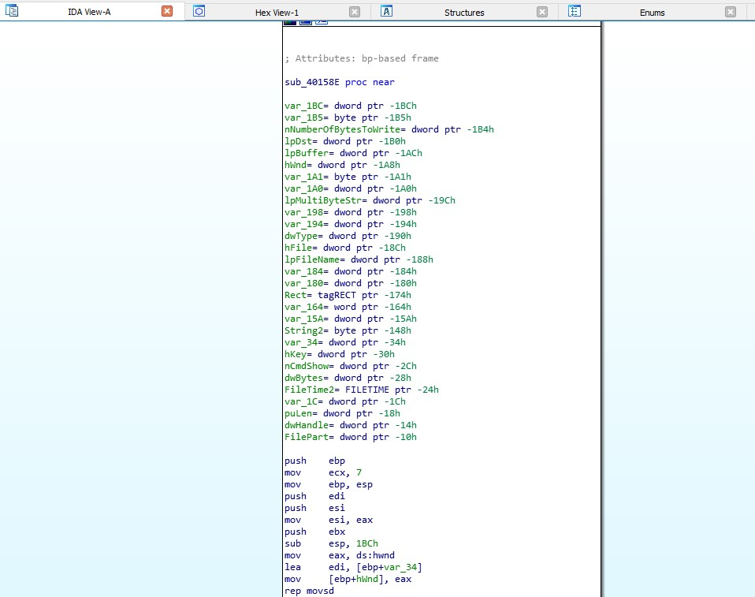

---

## 2. Initial Static Analysis

Using various static tools, we confirmed the sample as a Windows PE32 executable.

**Detect It Easy, basic PE scan:**  
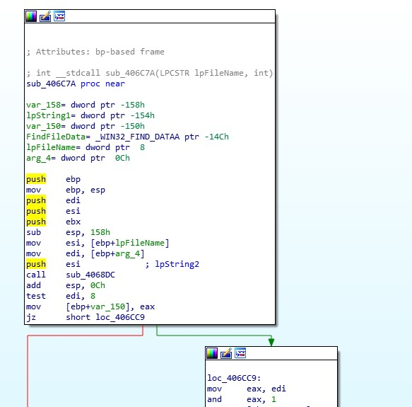  
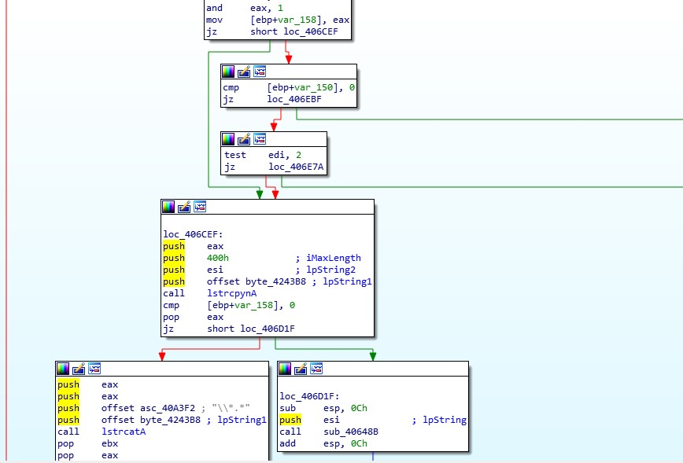  
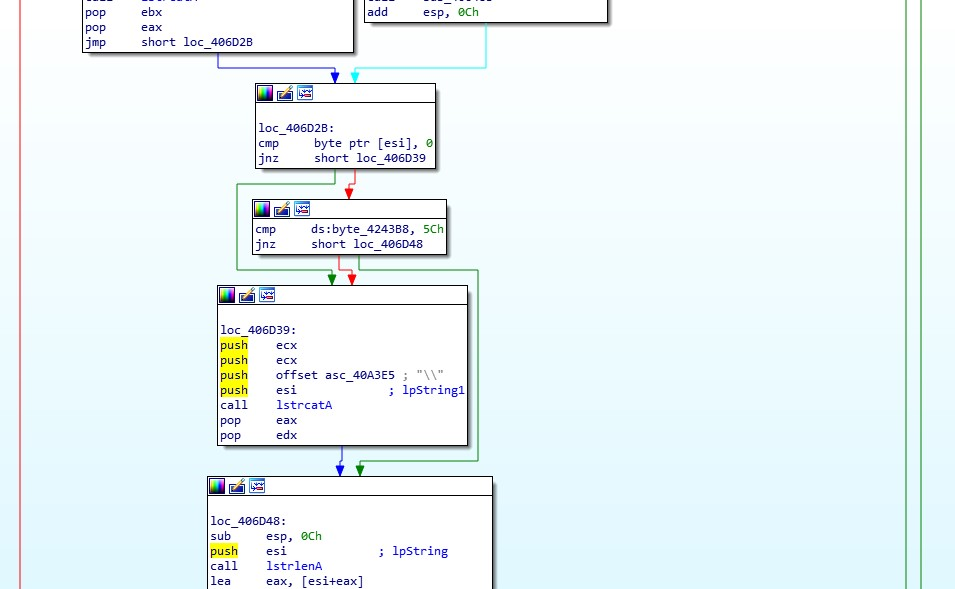  
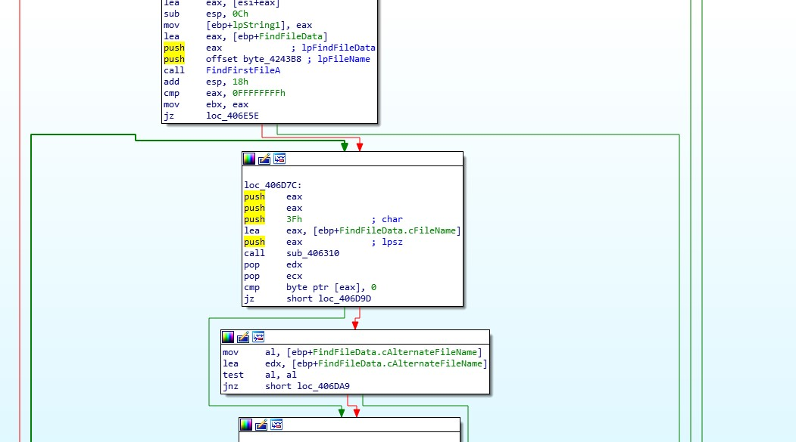  
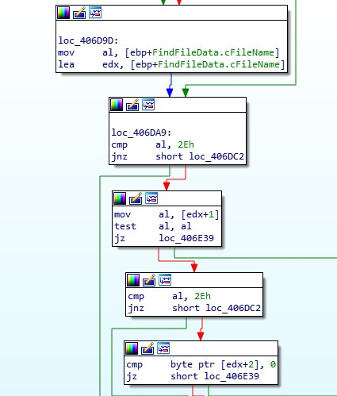

**Timestamp Analysis:**  
The compile time field indicates a 2017 date, consistent with the outbreak.
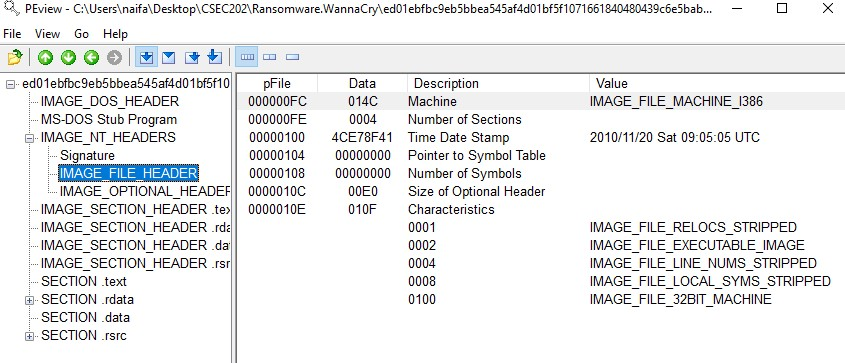

---

## 3. PE File Structure

### Section Analysis

A detailed review of PE sections was performed using Resource Hacker and similar tools.

- `.text`, `.rdata`, `.data` (standard)
- Suspicious extra or padded sections observed.

**Screenshots:**  
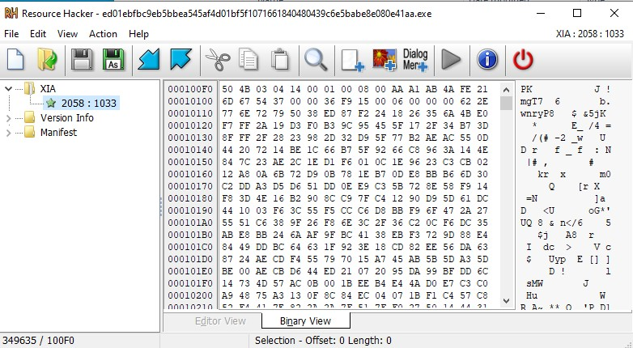  
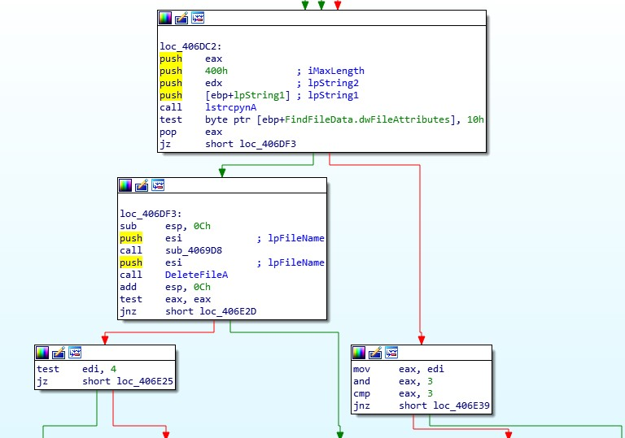  
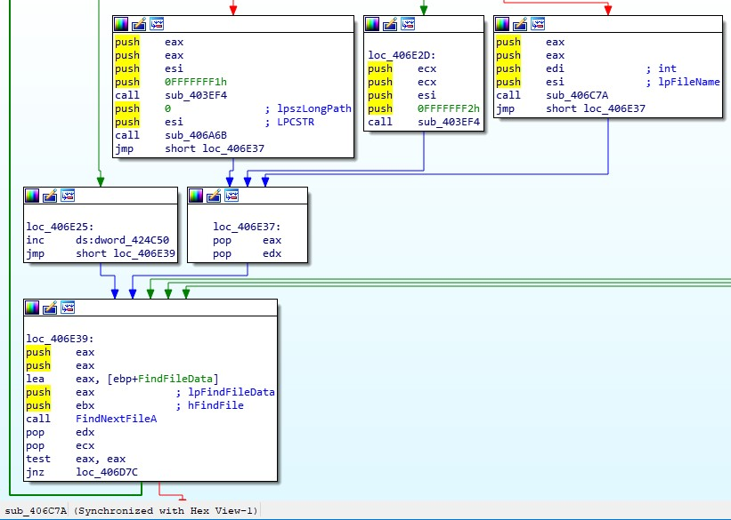  
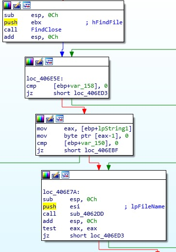  
  
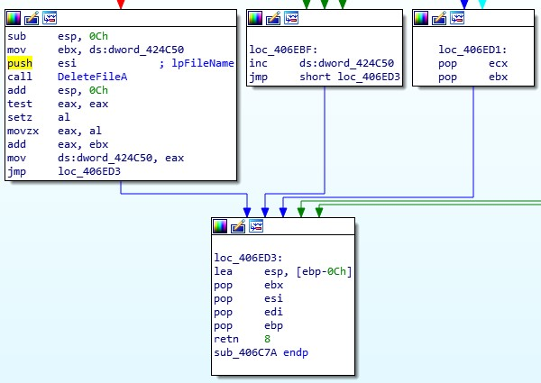

---

## 4. Strings and Resource Analysis

Strings analysis exposed key artifacts:

- Ransom message content
- Bitcoin addresses
- Kill switch domain
- List of encrypted file extensions

**Strings tool output:**  
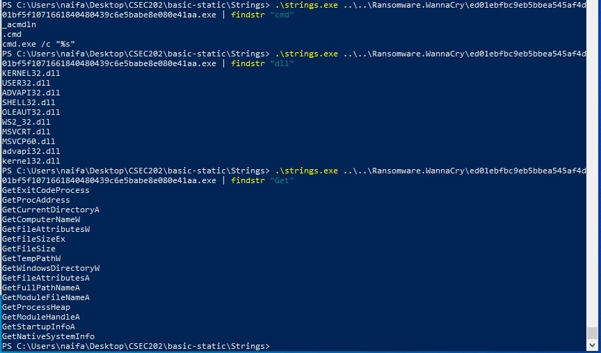  
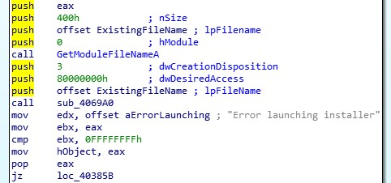  
  
  

---

## 5. Dynamic Analysis

### Lab Setup

Sample executed inside a controlled Windows VM. Monitored with Process Explorer, Regshot, etc.

#### **Process Explorer / Running Processes**
- WannaCry injects into legitimate processes, spawns new instances.

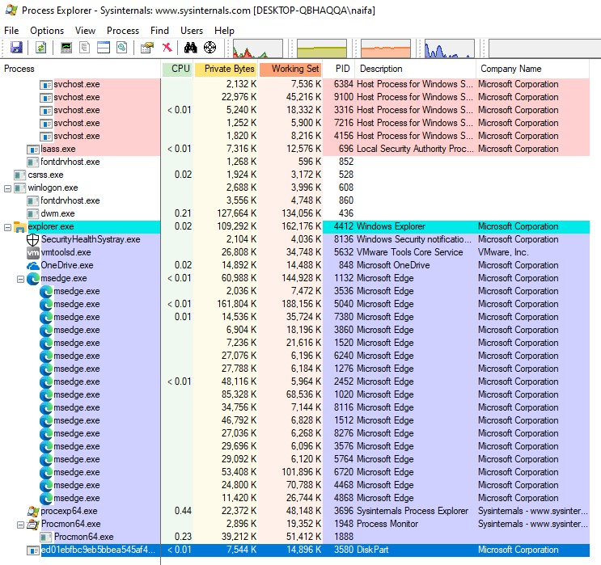  
  

#### **File Operations**

- Ransom notes dropped in multiple directories.
- Wallpaper changed by malware.

  
  
  
  
  
  
  

#### **Regshot / Registry Analysis**
- Persistence via registry Run keys and service creation.

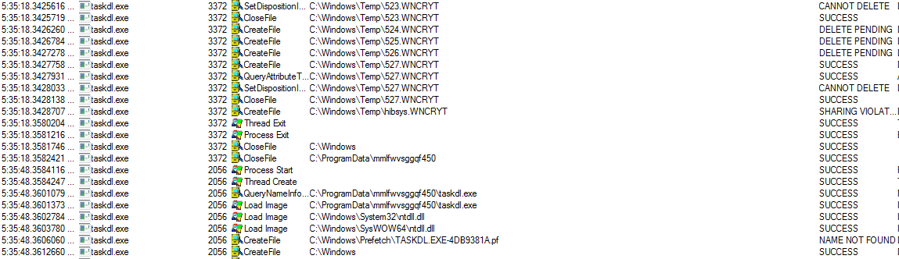  
  
  

---

## 6. Network Activity and Kill Switch

- WannaCry attempts to contact the kill switch domain at startup.
- SMB scanning observed.
- DNS requests and network activity logged.

**Network/URL screenshots:**  
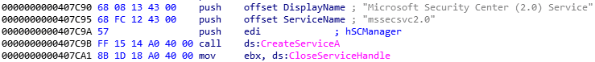  
  
  
  
  

---

## 7. Ransom Note & File Impact

- `@Please_Read_Me@.txt` dropped in all user directories.
- Custom desktop background set.

**Screenshots:**  
  
  
  
  

---

## 8. Persistence & Registry Changes

- Adds itself to Startup via registry keys.
- Installs as a service.

**Screenshots:**  
  
  
  

---

## 9. Indicators of Compromise (IOCs)

**File hashes:**  
- See VirusTotal screenshot (`varida.jpg`)

**Bitcoin wallets, kill switch domain, ransom note paths:**  
- Extracted from `strings.jpg` and resource screenshots.

**Network:**  
- Outbound attempts to `iuqerfsodp9ifjaposdfjhgosurijfaewrwergwea.com`
- Unusual SMB traffic (port 445)

**Registry:**  
- Persistence Run keys and custom service names.

---

## 10. Conclusions & Lessons Learned

WannaCry combined a wormable exploit with ransomware, creating a global incident. Key takeaways:

- Patch critical vulnerabilities immediately (EternalBlue/MS17-010 was patched before the outbreak!)
- Isolate and monitor network segments to limit wormable malware.
- Keep offline, secure backups to prevent ransomware impact.

---

## **Full List of All Screenshots Used**

For completeness, here’s every screenshot referenced (in order, including those not already shown above):

